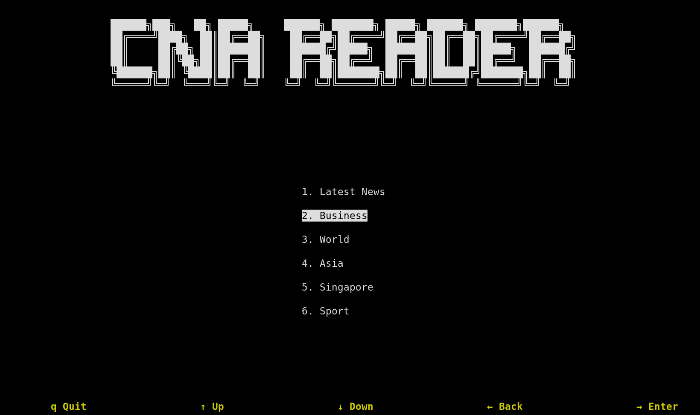

# cnareader

cnareader is a terminal user interface client for reading news from Channel News Asia.
It aims to give users a distraction and bloat free experience.

### Main Menu



### Headlines


### Article


## Usage

- Open a terminal window (Linux/MacOS)
- For windows, open a command prompt (search for cmd in the search bar)
- Enter the following command

```commandline
cnareader
```

- If using the executable for windows, simply double click to launch it.
- Use the arrow keys to navigate between screens, and press `q` to quit.

## Installation

### Install using Python/pipx

- If you have python3 on your computer, are using an OS that has it by default (MacOS, Linux)
- pipx is recommended over directly using pip to install cnareader, to run it in an isolated environment.
- For the commands below, use `python3` or `python` if one does not work.
- Similarly, `pip3` or `pip`

#### Windows

- If you installed python using the app-store, replace `python` with `python3`.

```commandline
python -m pip install --user pipx
python -m pipx ensurepath
pipx install cnareader
```

- You might need to close the current cmd window and open a new one after running `python -m pipx ensure path`

#### Linux

```commandline
python -m pip install --user pipx
python -m pipx ensurepath
pipx install cnareader
```

#### MacOS

```commandline
brew install pipx
pipx ensurepath
pipx install cnareader
```

### Download from executable

TODO
